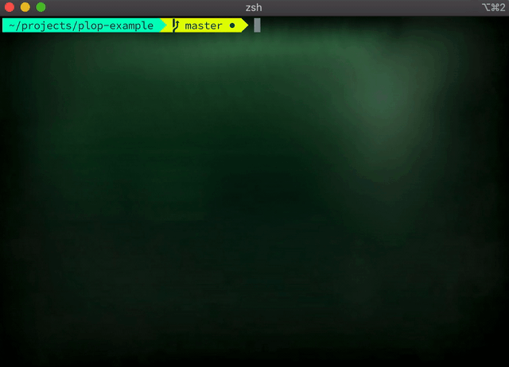

### Save time creating components

Working with a component-based framework involves a lot of creative work, in which obviously many components are created, which ideally always have the same structure and can be put together to form an application.

Most likely, each component begins with the same structure, e.g. styles, tests, logic etc. and with each piece a new file is needed.

Creating these files and always writing the same structure for components can be quite annoying. In this article, you will learn how to speed up this process and create your own simple scripts and templates that do all of this for you with the magic of PlopJS.

The goal is to have one single command that spits out everything you need for your component at once and always has the same custom structure. Having this helped me a lot in my daily work creating new components and significantly accelerated my work.

### Using templates from your IDE

Most likely you are already using your IDE templates to generate the components. This is a fairly simple approach, which is activated by default with the most popular IDEs.
For example, with [VSCode](https://code.visualstudio.com/docs/editor/userdefinedsnippets).

### Snippets are not enough

However, there are some limitations with it, and you still need to create separate files like your styles, your tests, your index files, etc.
Especially if you work with a large team with different IDEs and setups, you have to make sure that everyone follows the same pattern within a project, or you will have different approaches between all of your components, which have been created by different people and IDEs.

A good example and an important use case is working with a component library.
To create a new component that is added to your library, you always have to create not just one file, but several files in the same pattern, which is not possible with the built-in templates of most IDEs.
However, building components is required in every project, so adding this functionality increases the productivity of each project

### Plop your components

There's a pretty neat way to generate your components and define the structure and chains of what should happen.
Let's find out how this works.

## Introducing [PlopJS](https://github.com/plopjs/plop)

PlopJS is a scripting tool that I now use in most of my projects to generate my components or other workflows.
What is PlopJS? Let's check the official documentation:

> Micro-generator framework that makes it easy for an entire team to create files with a level of uniformity.

That sounds pretty great. But how can you add that to your component library or project?

### Component structure of the library

Before we start I should clarify some things here, for the following example we are using:

- [styled-components](https://styled-components.com/) for stylings
- [storybook](https://storybook.js.org/) for displaying our components
- [Jest](https://jestjs.io/) for testing.

However, these are just examples and you can use anything you want to generate your files.

With this tech stack, every component in your project should have the same structure (this is also highly opinionated and of course you can create your own structure as you like):

```
MyComponent
:- MyComponent.jsx        // Main file
:- myComponent.styles.js  // Stylings
:- myComponent.story.js   // Storybook
:- MyComponent.spec.js    // Tests
:- MyComponent.docs.md    // Documentation
:- index.js               // Index for exporting
```

In addition we have in our `src` folder a global `index.js` file which exports all the components from one place.

In the end, to create a component, our script should generate these five files and add one line to the global `index.js`, exporting this component.

NEWSLETTER

### Adding PlopJs to your project

If you follow the [install process](https://plopjs.com/documentation/#getting-started) you can install it directly into your project.

```
npm install --save-dev plop
```

With that you can start ploppin'. Let's start by adding the plop-script to your `package.json`

```
"scripts": {
    ...
    "generate": "plop",
    ...
  }
```

I call the script "generate", but you can of course call it the one that suits you best.

Now let's add a so called `plopfile.js` in the root of your project.
This is where all your plop-scripts and -commands are stored.

```js
module.exports = (plop) => {
  plop.setWelcomeMessage('Welcome to PLOP, what do you want to do?');
  plop.setGenerator('component', {
    description: 'Create a component',
    // Get info from user
    prompts: [
      {
        type: 'input',
        name: 'name',
        message: 'What is your component name?',
      },
    ],
};
```

This function is executed when you run the Plop script with `npm run generate`.
With `plop.setWelcomeMessage` you can display a message to the user at the beginning to describe what the script actually does.

PlopJS can even do more than one thing in this script, so we first need to tell it what we want to do so that the user can choose the expected behavior.

## Add generators

`plop.setGenerator` adds new functionality to the plop script. The first argument is the name of your action and the second is an object that defines what to do when the user chooses this option.

In our case, we add the `"Create a component"` option because we want to well, create a new component.
Before we create this component, however, we need an input. The created component needs a name.

### Give it a name

To get the name from the user, we can use the "prompts" option within the object in the second argument.
`prompts` is an array that defines all of the user's input. For our example, we only need a simple text entry that contains the name of the component. (There a [lot more options](https://plopjs.com/documentation/#using-prompts) to get information from the user using prompts)
Our prompt contains three things:

- `type` is the type of the action, in our case a simple `"input"`.
- `name` is the variable name to retrieve the inserted value at a later time.
- `message` is a message that is displayed in the command-line and tells the user what to enter.

### Plop actions

The next part of the object in the generator function is the "actions" part. Here we can define our chain of actions, what the script should do.
[Several action types](https://plopjs.com/documentation/#built-in-actions) are already integrated, which you can use from plopJS. If this is not enough, you can also write your own actions.

In our example we only need two different action types:

- Add -- Adding a whole new file (styles, component, tests etc.)
- Append -- Adding something to an existing file (add the export to the `index.js`)

## Adding files

Let's start by adding out main component file. For that we add a new action into the `actions` array.

```js
module.exports = (plop) => {
  plop.setWelcomeMessage('Welcome to PLOP, what do you want to do?');
  plop.setGenerator('component', {
    description: 'Create a component',
    // Get info from user
    prompts: [
      {
        type: 'input',
        name: 'name',
        message: 'What is your component name?',
      },
    ],
    actions: [
      "------------------------------",
      "Generating a new component...",
      "------------------------------",
      {
        // Add the main file
        type: "add",
        path: "src/components/{{pascalCase name}}/{{pascalCase name}}.tsx",
        templateFile: "plop-templates/Component.ts.hbs",
      },
    ]
};
```

The object consists of three different values.

- `type` describes the type of action. In our case, this is `"add"` because we want to obviously add something.
- `path` is the directory and filename we want to add or create. With the help of these `{{` we are using the [handlebars](https://handlebarsjs.com/) syntax, giving us the option to get the previous user input stored as the value `name`. With the previous value `pascalCase` we are defining in what format we want the directory or file be called.
- `templateFile` is the directory to our template file for this action. We will come to this template file in the next part.

## Template files

Most actions use template files that you can use to generate your files for your component. For our project or component library we create a folder called "plop-templates" in the root directory of the project.
There we save all template files that we use to generate the components. For the main component file we need a `Component.js.hbs` file and are filled with:

```js
import React, {FC} from 'react';

function {{pascalCase name}}(props) {
  return (
    <div>
      {{pascalCase name}}
    </div>
  );
};

export default {{pascalCase name}};
```

As you can see the template file looks almost like a real component, except everywhere we would insert the component name we use `{{ pascalCase name}}`, this will be filled from plopJS with the inserted name from the `prompt`.

You can use this kind of templates and functionality for all your other files like `styles`, `tests`, etc.

## Append the export to the index file

So much for adding. What about adding a new line to our global file "index.js"? For this we can use the "attach" action from plopJS.

```js
  {
    // Append to the global index file
    type: "append",
    path: "src/index.ts",
    templateFile: "plop-templates/global_index.ts.hbs",
  },
};

```

It's basically the same structure as the adding, except we use `"append"` for the `type` value.
The `templateFile` will contain the single line that will be added to our index file.

```js
export { default as {{pascalCase name}} } from './components/{{pascalCase name}}';
```

### Adding the rest to the script

With all of that we can add the actions for all our files and combine everything in the plop-script.
Adding plain strings to the `actions`, you can simply print out messages between your actions.

```js
module.exports = (plop) => {
  plop.setWelcomeMessage('Welcome to PLOP, what do you want to do?');
  plop.setGenerator('component', {
    description: 'Create a component',
    // Get info from user
    prompts: [
      {
        type: 'input',
        name: 'name',
        message: 'What is your component name?',
      },
    ],
    actions: [
      '------------------------------',
      'Generating a new component...',
      '------------------------------',
      {
        // Add the main file
        type: 'add',
        path: 'src/components/{{pascalCase name}}/{{pascalCase name}}.jsx',
        templateFile: 'plop-templates/Component.js.hbs',
      },
      {
        // Add the story file
        type: 'add',
        path: 'src/components/{{pascalCase name}}/{{pascalCase name}}.story.jsx',
        templateFile: 'plop-templates/Component.story.js.hbs',
      },
      {
        // Add the styles
        type: 'add',
        path: 'src/components/{{pascalCase name}}/{{pascalCase name}}.styles.js',
        templateFile: 'plop-templates/Component.styles.js.hbs',
      },
      {
        // Add the test file
        type: 'add',
        path: 'src/components/{{pascalCase name}}/{{pascalCase name}}.test.jsx',
        templateFile: 'plop-templates/Component.test.js.hbs',
      },
      {
        // Add index file
        type: 'add',
        path: 'src/components/{{pascalCase name}}/index.js',
        templateFile: 'plop-templates/index.js.hbs',
      },
      {
        // Append to the global index file
        type: 'append',
        path: 'src/index.js',
        templateFile: 'plop-templates/global_index.js.hbs',
      },
      '------------------------------',
      '🤲 Welcome to the world little friend 🤲',
      '------------------------------',
    ],
  });
};
```

Now when when we run `npm run generate`, the script will take over all the creation of out component files for us:



Et voilá, everything we need will be done with a single command and will never have the problem of creating all of these files by hand. All files and components now start with the same structure, regardless of who and where they are executed.
