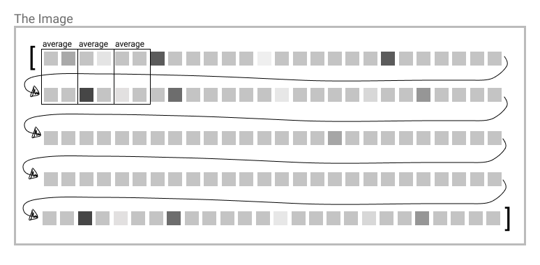

## Calculate the array

Basically what we have now is a very long one dimensional array of all pixels in that image in the size defined in the beginning.
But now we want to downscale that image to a smaller size, because we want to see the emojis right?
So now it gets tricky, because we need to iterate over that one dimensional array representing an 2 dimensional image and calculate the average of specific blocks. Maybe lets illustrate that to make that a bit more clear:



So a little spoiler, this is how it works for me. There is probably a better and more efficent solution out there and I would be happy to hear it from you. Feel free to write me a message if you have found something more effiecent.

```js{}
const indexArr = [];
let pointer = 0;
let xLinePosition = 0;
const blockLineCount = size * elementSize;
```

Let's go over it step by step. We need two iterators and a pre calculated constant.The constent `blockLineCount` is telling me how many emojis we want in one line.

The value `pointer` is representing the current position on which emoji we are currently at as a sum of pixels, so starting at position `0`.

The `xLinePosition` is representing the index of the horizontal line also starting by `0`.

The `indexArr` is the bucket where we store all our averages that we have calculated.

Our condition to stop the loop is when the pointer reaches the end of the array. then we have all the emojis calculated and can stop:

```js{5}
const indexArr = [];
let pointer = 0;
let xLinePosition = 0;
const blockLineCount = size * elementSize;
while (pointer < greyArr.length) {}
```

To calculate the average we need first to sum up all the values and divide them by the emoji size and push that value to our final array:

```js{6,7}
const indexArr = [];
let pointer = 0;
let xLinePosition = 0;
const blockLineCount = size * elementSize;
while (pointer < greyArr.length) {
  let sum = 0;
  indexArr.push(Math.round(sum / elementSize ** 2 / (1 / elementCount)));
}
```

But the value would always be 0. Which is kind of useless... So we need to iterate again over every pixel in one block so 2 dimensional over the size of the emoji, defined as `elementSize`.
Then we want to get the pixel at that positoon added to our sum. So we sum up the position of the pointer which means the position of the block we are calculating (`pointer`) plus the horizontal position inside the block (`j`) plus the vertical position times the length of one line in pixels (`size * i` for having the correct pixel in the 1 dimensional array).

```js{6,7}
for (let i = 0; i < elementSize; i++) {
  for (let j = 0; j < elementSize; j++) {
    sum += greyArr[pointer + j + size * i];
  }
}
```

Since we are using a while loop we need to do increase to pointer to not have an infinite loop here. So first we have to check if have reached the end of the horizontal line with the `xLinePosition`.
If yes we need to add a whole line of pixels to the pointer to get to the new position at the beginning and also set the `xLinePosition` back to 0.
If NOT, we just increase the pointer by one emoji so `elementSize` and set the xLinePosition one position further

```js{}
if (xLinePosition >= size / elementSize - 1) {
  pointer += blockLineCount - (size - elementSize);
  xLinePosition = 0;
} else {
  pointer += elementSize;
  xLinePosition++;
}
```

All together we have here the core of calculating our downsized image ready to drawn as emojis in the correct size:

```js{}
const indexArr = [];
let pointer = 0;
let xLinePosition = 0;
const blockLineCount = size * elementSize;
while (pointer < greyArr.length) {
  let sum = 0;
  for (let i = 0; i < elementSize; i++) {
    for (let j = 0; j < elementSize; j++) {
      sum += greyArr[pointer + j + size * i];
    }
  }
  indexArr.push(Math.round(sum / elementSize ** 2 / (1 / elementCount)));
  if (xLinePosition >= size / elementSize - 1) {
    pointer += blockLineCount - (size - elementSize);
    xLinePosition = 0;
  } else {
    pointer += elementSize;
    xLinePosition++;
  }
}
return indexArr;
```
